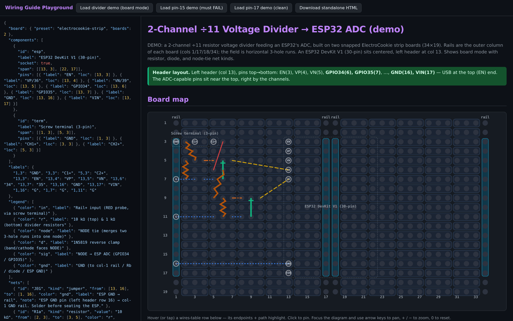
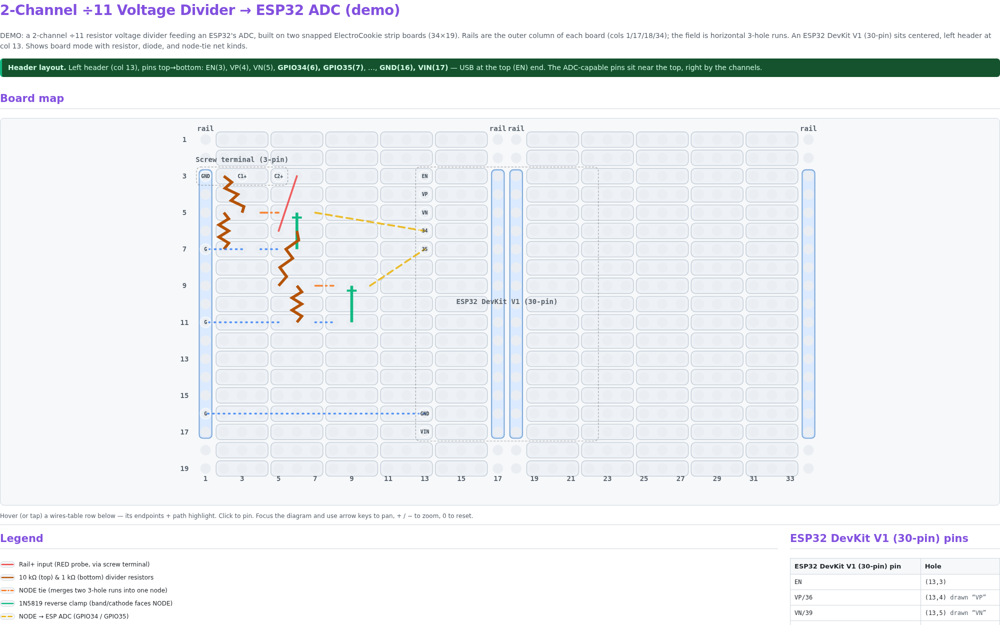
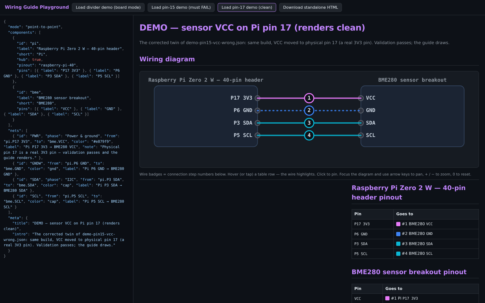
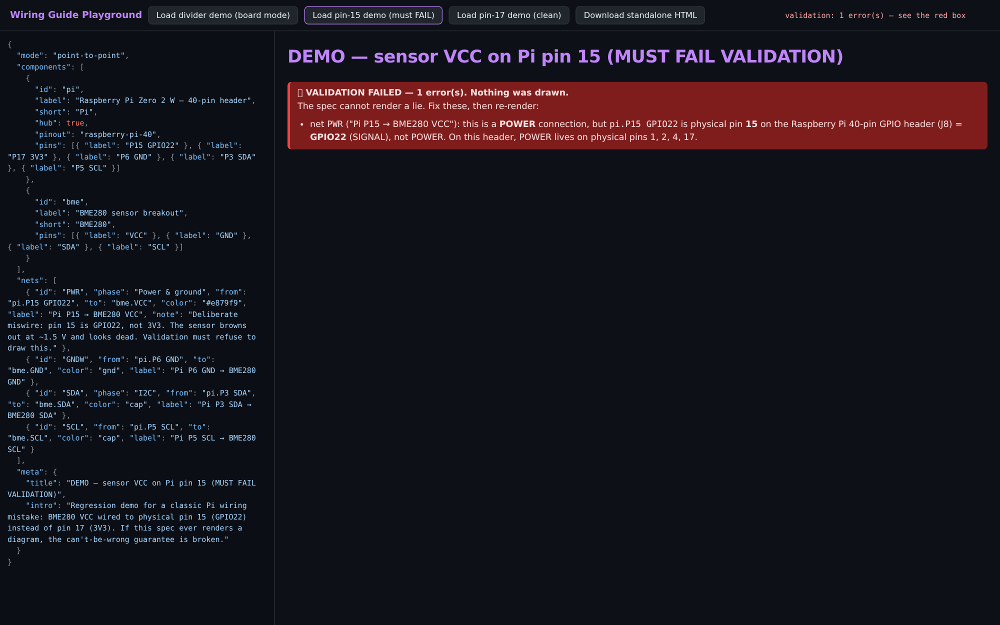

# wiring-guide

A tiny, declarative renderer for hand-wiring guides (perfboard / stripboard /
breadboard). Define the **board**, **components**, and **wires** as a JSON spec;
get back an interactive, color-coded guide you'd otherwise hand-build per project —
an SVG board map + hover/click-linked wire table + legend + build order + pre-power
checks. Vanilla JS + SVG, **no build step**, **no dependencies**, self-contained output.



Origin: after hand-coding the same `wiring.html` for several projects (and getting
the board topology wrong more than once), this extracts that renderer into something
spec-driven so the next board is a JSON file, not an afternoon.

## Use

**Playground** (edit JSON, live preview, export) — serve over HTTP (`fetch` of
the spec/library is blocked from `file://`):
```
python3 -m http.server 8801    # then open http://localhost:8801/
```
Click **Load divider demo**, edit the JSON, watch it re-render. **Download
standalone HTML** inlines the library + spec into one portable file.

**Embed** in any page — `wiring.js` is the whole library, nothing to install:
```html
<div id="app"></div>
<script src="wiring.js"></script>
<script>renderWiringGuide(spec, document.getElementById('app'));</script>
```

## API

`renderWiringGuide(spec, mountEl, options?)` clears `mountEl`, renders the guide
into it, and returns it; call again with a new spec to re-render. It dispatches
on `spec.mode` (board vs point-to-point). The library injects its stylesheet once
(`<style id="wg-css">` in `<head>`), scoped under the `.wg` class it adds to the
mount. A spec that fails validation throws `WiringValidationError` (with
`.errors`) after mounting a visible error box.

### Options

The optional third argument toggles display and render choices. Options resolve
as **defaults ← `spec.options` ← the argument** (the argument wins), so a spec
can carry its own display prefs and a caller can still override per render. Every
default matches the standard full guide, so omitting options changes nothing.

| option | default | effect |
|---|---|---|
| `pinTables` | `true` | per-component pin tables |
| `legend` | `true` | the color legend |
| `buildOrder` | `true` | the build-order section |
| `checks` | `true` | the pre-power checks section |
| `drc` | `true` | the light DRC collision/stacked-joint overlay |
| `hints` | `true` | the "hover a row" interaction hint |
| `theme` | `'dark'` | `'dark'` or `'light'` — a fully themed light palette |

```js
renderWiringGuide(spec, el, { theme: 'light', hints: false, drc: false });
```



The **can't-be-wrong validation is intentionally not an option** — it's the
library's core guarantee, not a display choice.

Also on `WiringGuide`: `render` (the same function), `validate(spec)` — the
pure, DOM-free validation pass returning `{ errors, warnings }` (runs under
`require('./wiring.js')` in Node) — and `PRESETS` / `PINOUTS` / `PALETTE`, the
board-geometry builders, physical pinout maps, and color palette (all DOM-free;
rendering itself needs a real DOM).

> **Specs are trusted input.** `meta.intro`, notes, build-order steps, checks,
> and net labels/notes are injected as HTML (that's what makes `<strong>` in a
> guide work). Don't render spec JSON from sources you don't trust.

## Spec shape
Illustrative JSONC (not paste-runnable — the `//` comments aren't valid JSON;
the playground uses strict `JSON.parse`):
```jsonc
{
  "board": { "preset": "electrocookie-strip", "boards": 2 },   // or explicit {cols,rows,rails,segments}
  "components": [
    { "id":"esp", "label":"ESP32 DevKit V1", "span":[[13,3],[22,17]],
      "pins": [{ "label":"GPIO34", "loc":[13,14] }, { "label":"GPIO35", "loc":[13,13] }] } // pins → labeled holes + a pin table
  ],
  "labels": { "13,14":"34" },                                   // optional short hole-text overrides
  "nets": [
    { "id":"S1", "kind":"jumper",   "from":[7,5], "to":[13,14], "color":"sig", "label":"…", "note":"…" },
    { "id":"R1a","kind":"resistor", "from":[3,3], "to":[3,5],  "color":"r", "value":"10k" }
  ],
  "legend": [ { "color":"sig", "label":"NODE → ADC" } ],
  "meta": { "title":"…", "intro":"…", "notes":[{"type":"ok","html":"…"}],
            "buildOrder":["…"], "checks":["…"] }
}
```

For a minimal spec you can copy/paste straight into the playground, see
[`templates/perfboard.json`](templates/perfboard.json):
```json
{
  "board": { "preset": "perf", "cols": 20, "rows": 16 },
  "components": [
    { "id": "u1", "label": "Your part", "socket": true, "span": [[6, 4], [9, 8]],
      "pins": [{ "label": "A", "loc": [6, 4] }, { "label": "B", "loc": [6, 8] }] }
  ],
  "nets": [
    { "id": "W1", "kind": "jumper", "from": [6, 4], "to": [12, 4], "color": "sig", "label": "example wire" }
  ],
  "legend": [ { "color": "sig", "label": "signal" } ],
  "meta": {
    "title": "Perfboard — starter template",
    "intro": "A generic perfboard: every hole is isolated (no buses).",
    "buildOrder": [ "Place parts, then run wires point to point." ]
  }
}
```

### Component colors
Board-mode components may optionally set a `colors` object; all four keys are optional:

```jsonc
"colors": { "fill":"none", "border":"#c084fc", "pin":"sig", "label":"#fff" }
```
Values accept a palette name or any CSS color, including 8-digit `#RRGGBBAA` (alpha last).

- `kind` ∈ `jumper` | `resistor` | `diode` | `cap`. Coordinates are `[col,row]`, 1-indexed.
- Colors are keys into a palette (`in node gnd sig r d cap`) or raw `#hex`.

**Full field-by-field reference: [docs/spec.md](docs/spec.md).**

### Point-to-point mode
Add `"mode": "point-to-point"` at the top level to skip the board entirely and render
direct `component.pin → component.pin` wiring (module pins soldered straight to a Pi
header, etc.): a hub-and-spoke diagram with numbered wire badges + a phase-grouped,
numbered connection table that IS the build order. `pins` is an array of `{label, loc?, notes?}` objects;
net endpoints may be `"comp.pin"` strings (or board-mode `[col,row]` coords, reverse-
resolved — so a board spec can flip modes). See `docs/design/point-to-point-mode.md`
and `specs/demo-pin17-vcc-correct.json` (a point-to-point example).



### Board presets
| preset | board | notes |
|---|---|---|
| `electrocookie-strip` | ElectroCookie strip | rails = outer column of each board; horizontal 3-hole field runs. `boards` sets the **grid**: `2` = 2×1 (horizontal, 4 rail lines), `{x:1,y:2}` = vertical (2 rail lines), `{x:2,y:2}` = 2×2. |
| `breadboard-mini` | 170-pt | vertical 5-hole terminal strips (a–e / f–j) + center ravine; no power rails. `cols` overrides (default 17). |
| `breadboard-half` | 400-pt | terminal strips + top/bottom power rails. `cols` default 30. |
| `breadboard-full` | 830-pt | terminal strips + power rails. `cols` default 63. |
| `perf-4x6cm` / `perf-5x7cm` / `perf-7x9cm` | protoboards | isolated holes; hole counts approximate per maker — override `cols`/`rows`. |
| `perf` | generic perf | isolated holes; set `cols`/`rows`. |

Buses are orientation-aware: a run is `{row,c0,c1}` (horizontal) or `{col,r0,r1}` (vertical);
rails likewise. Unknown/absent preset → supply explicit `cols`/`rows`/`rails`/`segments`.
Breadboard rows are numeric here (row 1 = top); terminal blocks map to a–e / f–j with the
ravine between them.

## Files
- `wiring.js` — the renderer (`renderWiringGuide(spec, el)`), CSS-injecting, preset-aware.
- `index.html` — the playground.
- `specs/demo-divider-adc.json` — a 2-channel voltage-divider → ADC guide (board-mode example).
- `specs/demo-pin17-vcc-correct.json` / `specs/demo-pin15-vcc-wrong.json` — point-to-point + can't-be-wrong demos.
- `docs/spec.md` — the full spec-format reference.
- `templates/` — ready-to-use starter specs (copy one instead of starting blank).
- `test/run-validation.js` — the validation harness (plain node, zero deps).

## Light DRC (duplicate-hole check)
The renderer flags holes where **≥2 leads collide** — 2+ net legs, or a lead on a
non-socket part pin — with a red warning box + `console.warn`. A jumper landing on a
`socket: true` component pin (e.g. an ESP header) is fine. Mark plug-in parts
`"socket": true`; leave through-hole parts (screw terminals, etc.) without it.
This is the cheap subset only — **full net-tracing DRC is intentionally out of scope.**

## Can't-be-wrong validation
The spec cannot render a lie. Opt a header component into a physical pinout —
`"pinout": "raspberry-pi-40"` — and the renderer validates every pin and wire
against the real 40-pin header: pin names may not misstate a pin's function
(`"P15 3V3"` is rejected — pin 15 is GPIO22), power/ground pins can't be
disguised as signals, `labels` overrides can't renumber a pin, and every net's
electrical role (`role` on the net / `pinRoles` on a component / inferred from
names like VCC · 3V3 · 5V · GND) must land on a pin of that role. Any violation
**refuses to render**: a red "VALIDATION FAILED" box + a thrown
`WiringValidationError` (`WiringGuide.validate(spec)` runs the same pass
headlessly; `node test/run-validation.js` exercises it). Specs with no `pinout`
and no roles are untouched. Canvas pin labels, pin tables and the wires table
all read one resolved map, so they cannot disagree. See
`docs/design/cant-be-wrong.md`; demo pair: `specs/demo-pin15-vcc-wrong.json`
(must fail — a sensor's VCC wired to a signal pin instead of a power pin) /
`specs/demo-pin17-vcc-correct.json` (the same build, corrected).



The **other end** of the wire gets the same guarantee for free: reference a
common breakout by `"module": "hc-sr04"` and its pins arrive with electrical
roles attached, so wiring 5V onto a signal pin is rejected without hand-listing
a thing. Built-ins in `WiringGuide.MODULES` (HC-SR04, DHT22/AM2302, DHT11,
DS18B20, MPU-6050, SSD1306, BME280, PN532); see the [spec](docs/spec.md#modules)
and `specs/hc-sr04-arduino-distance.json`.

## Development
```
node test/run-validation.js    # geometry + spec lint + validation checks, zero deps
```
CI (gitea Actions, `.gitea/workflows/ci.yml`) runs the same command on every push
to `main` and every PR. See `CONTRIBUTING.md` for the design principles (zero
build step, presets over hand-coded hole coordinates).

## Browser support
Evergreen browsers (anything with ES2015, SVG, and CSS grid — Chrome, Firefox,
Safari, Edge). There's no transpile step, so no legacy-browser story. The
validation pass and the `require()` path run on any maintained Node (≥ 14).

## Roadmap
Full net-tracing DRC (a node-overflow check beyond the cheap duplicate-hole subset),
a library of ready-to-use board presets (see the open issues), Wokwi interop, and
render/display configurability are deferred.

## License
[MIT](LICENSE) © Anigeek
